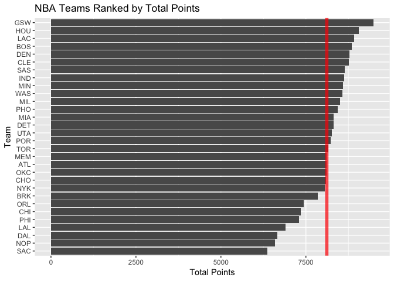
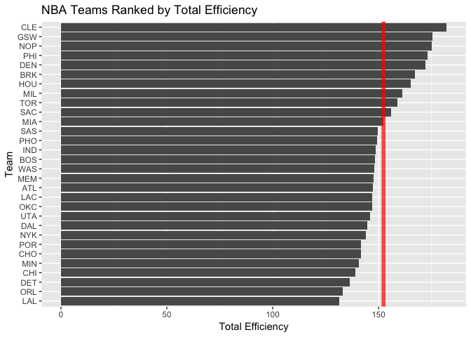
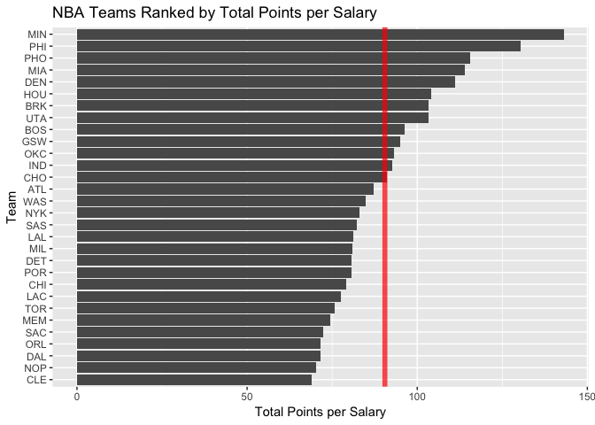

workout01-joey-kratz
================

``` r
library(ggplot2)
library(readr)
team_data <- read_csv(file="../data/nba2018-teams.csv")
```

    ## Parsed with column specification:
    ## cols(
    ##   team = col_character(),
    ##   experience = col_integer(),
    ##   salary = col_integer(),
    ##   points3 = col_integer(),
    ##   points2 = col_integer(),
    ##   points1 = col_integer(),
    ##   points = col_integer(),
    ##   off_rebounds = col_integer(),
    ##   def_rebounds = col_integer(),
    ##   assists = col_integer(),
    ##   steals = col_integer(),
    ##   blocks = col_integer(),
    ##   turnovers = col_integer(),
    ##   fouls = col_integer(),
    ##   efficiency = col_double()
    ## )

Basic Rankings
==============

``` r
avg_team_salary <- mean(team_data$salary)
ggplot(team_data, aes(x=reorder(team, salary), y=salary)) + geom_bar(stat="identity") + coord_flip() + geom_hline(yintercept=avg_team_salary, col="red", lwd=2, alpha=0.7) + labs(x="Team", y="Salary (in millions)", title="NBA Teams Ranked by Total Salary")
```


``` r
avg_team_points <- mean(team_data$points)
ggplot(team_data, aes(x=reorder(team, points), y=points)) + geom_bar(stat="identity") + coord_flip() + geom_hline(yintercept=avg_team_points, col="red", lwd=2, alpha=0.7) + labs(x="Team", y="Total Points", title="NBA Teams Ranked by Total Points")
```



``` r
avg_team_eff <- mean(team_data$efficiency)
ggplot(team_data, aes(x=reorder(team, efficiency), y=efficiency)) + geom_bar(stat="identity") + coord_flip() + geom_hline(yintercept=avg_team_eff, col="red", lwd=2, alpha=0.7) + labs(x="Team", y="Total Efficiency", title="NBA Teams Ranked by Total Efficiency")
```



``` r
# For my index, I will be comparing total points per total salary for each NBA team.
avg_team_pointspersalary <- mean(team_data$points/team_data$salary)
ggplot(team_data, aes(x=reorder(team, points/salary), y=points/salary)) + geom_bar(stat="identity") + coord_flip() + geom_hline(yintercept=avg_team_pointspersalary, col="red", lwd=2, alpha=0.7) + labs(x="Team", y="Total Points per Salary", title="NBA Teams Ranked by Total Points per Salary")
```



``` r
# The reason I want to use this index is because I want to see efficiency from an
# economic standpoint. Based on how much money is invested in the teams, how many
# points per dollar do the players earn.
```

Reflection
==========

-   This was my first time working with a project with this file structure. Learning to keep track of the different files and where things were and what directory I was in ended up being very challenging.
-   Relative paths are important because due to the fact that they are reproducable, they allow an individual to look at my online repository and truly understand where I am organizing my files.
-   This was my second time using r script.
-   The hardest part by far was getting the hang of GitHub and setting up both my remote and local repositories.
-   The hard part despite seeing it done in class was using GitHub and setting up a repository.
-   It took me 4 hours to complete this homework, with the most time consuming part being setting up GitHub.
-   I found it interesting that we can modify data like this.
