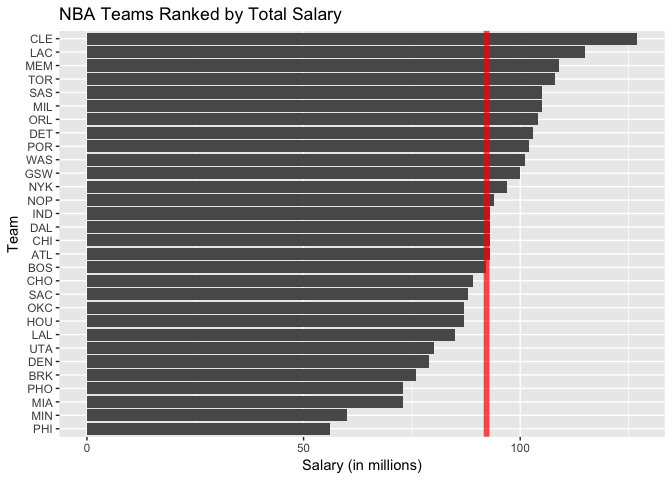

workout01-joey-kratz
================

``` r
library(ggplot2)
library(readr)
team_data <- read_csv(file="../data/nba2018-teams.csv")
```

    ## Parsed with column specification:
    ## cols(
    ##   team = col_character(),
    ##   experience = col_integer(),
    ##   salary = col_integer(),
    ##   points3 = col_integer(),
    ##   points2 = col_integer(),
    ##   points1 = col_integer(),
    ##   points = col_integer(),
    ##   off_rebounds = col_integer(),
    ##   def_rebounds = col_integer(),
    ##   assists = col_integer(),
    ##   steals = col_integer(),
    ##   blocks = col_integer(),
    ##   turnovers = col_integer(),
    ##   fouls = col_integer(),
    ##   efficiency = col_double()
    ## )

Basic Rankings
==============

``` r
avg_team_salary <- mean(team_data$salary)
ggplot(team_data, aes(x=reorder(team, salary), y=salary)) + geom_bar(stat="identity") + coord_flip() + geom_hline(yintercept=avg_team_salary, col="red", lwd=2, alpha=0.7) + labs(x="Team", y="Salary (in millions)", title="NBA Teams Ranked by Total Salary")
```



``` r
avg_team_points <- mean(team_data$points)
ggplot(team_data, aes(x=reorder(team, points), y=points)) + geom_bar(stat="identity") + coord_flip() + geom_hline(yintercept=avg_team_points, col="red", lwd=2, alpha=0.7) + labs(x="Team", y="Total Points", title="NBA Teams Ranked by Total Points")
```


``` r
avg_team_eff <- mean(team_data$efficiency)
ggplot(team_data, aes(x=reorder(team, efficiency), y=efficiency)) + geom_bar(stat="identity") + coord_flip() + geom_hline(yintercept=avg_team_eff, col="red", lwd=2, alpha=0.7) + labs(x="Team", y="Total Efficiency", title="NBA Teams Ranked by Total Efficiency")
```


