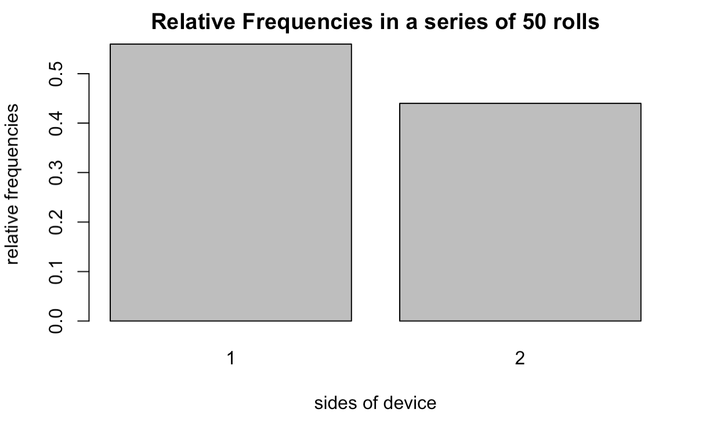

# How to Use Roller Package

## Device Rolling

The package `"roller"` is for simulating "rolling" a device any given number of times. This device can be modified with n>=2 sides and different probabilities (as long as they add up to 1). This package will aid in the simulation as well as the visualization of the frequencies of the results. 

## Creating a `device`

The first step is to create a `"device"` object with the function `device()`:

```{r}
device1 <- device()
device1
```
```
  ##> object "device"
  ##>
  ##>   sides prob
  ##> 1 1     0.5
  ##> 2 2     0.5
```
By default, `device()` creates a _fair_ coin with standard sides `1`, and 
`2`, and with probability values for each side of 0.5.

You can change the defatuls with arguments `sides` and `prob`:

```{r}
loaded <- device(sides = c('three', 'two'), prob = c(3/5, 2/5))
loaded
```
```
  ##> object "device"
  ##>
  ##>   sides prob
  ##> 1 three 0.6
  ##> 2 two   0.4
```

## Rolling a device

After defining a `"device"` object, you can use the function `roll()` to
_roll_ a device a given number of `times`. The output will be an object of class 
`"roll"`, which will contain the vector of `rolls`:

```{r}
roll50 <- roll(device1, times = 50)
roll50
```
```
  ##> object "roll"
  ##> 
  ##> $rolls
  ##> 2 1 2 1 1 1 2 1 1 1 1 2 1 2 1 2 1 2 1 2 1 2 2 2 2 1 1 1 1 1 2 1 1 2 1 2 1 1 1 2 1 1 1 1 2 1 1 1 1 2
```

The `summary()` function gives you a nice table of frequencies:
```{r}
summary(roll50)
```
```
  ##> summary "rolls"
  ##>
  ##>   side  count prop
  ##> 1    1     32 0.64
  ##> 2    2     18 0.36
```

## Plotting relative frequencies

You can use the function `plot()` to create a barplot with the relative 
frequencies of a series of rolls:

```{r, fig.show='hold'}
plot(roll50)
```

<!-- -->

## A more complex example...

```{r}
fair_dev <- device(sides = letters[1:8], prob = rep(1/8, 8))
fair_dev
```
```
  ##> object "device"
  ##>
  ##>   sides prob
  ##> 1     a 0.125
  ##> 2     b 0.125
  ##> 3     c 0.125
  ##> 4     d 0.125
  ##> 5     e 0.125
  ##> 6     f 0.125
  ##> 7     g 0.125
  ##> 8     h 0.125
```

```{r}
fair500 <- roll(fair_dev, times = 500)
fair500
```
```
  ##> object "roll"
  ##> 
  ##> $rolls
  ##> d c h a f c g a d e g c b f f d h e f f c d d c e f d c f e e d a g h d g h g h h c f e a h e e a d a c f g a d f d e c b f g e g f d h h e a c c d c f h g e e d g e c d a g b h a e h b h e e h b d h h a a f c e c f b e a d c g e h e f d a h a b g a h d b h b f a h g b f g c g e g b e g g e g h c f c b b c g c b f g g f f c c g d b f e c e b d e h a d a g f c h g h d h c a e d b f d g c b d a b h f g e f f h b a h c d b h f c g f h e f e c b g b e b g g g e g g e g d c c h b c g g c f b g h f f h f a e b d a d f a g d e d a a b d a g f g c g f c e d c f d h e h f c f f f b h d f g h c f e a g g e d c h e b d b d a a h e a f c b e e h b d c g a c c d b h a h a f d e d g a b b a d h d d b b d f g d f a a h h g g e b a f a e a f h e h e h e g f a g f c c h b f h b e f c c h b b a f a e c a d a c b d a e h g c a h c a e f b b e h e g b a f e g a a a f f c g c b f f g d c b b e b c e c c h e f e b d a d h f h c a c f e e a b b f h f h b a g g c a c c c g g h e a e b a d f a c g d b d b f f 
```

```{r}
summary(fair500)
```
```
  ##> summary "rolls"
  ##>
  ##>   side  count    prop
  ##> 1    a     62   0.124
  ##> 2    b     58   0.116
  ##> 3    c     65   0.130
  ##> 4    d     56   0.112
  ##> 5    e     65   0.130
  ##> 6    f     70   0.140
  ##> 7    g     63   0.126
  ##> 8    h     61   0.122
```


